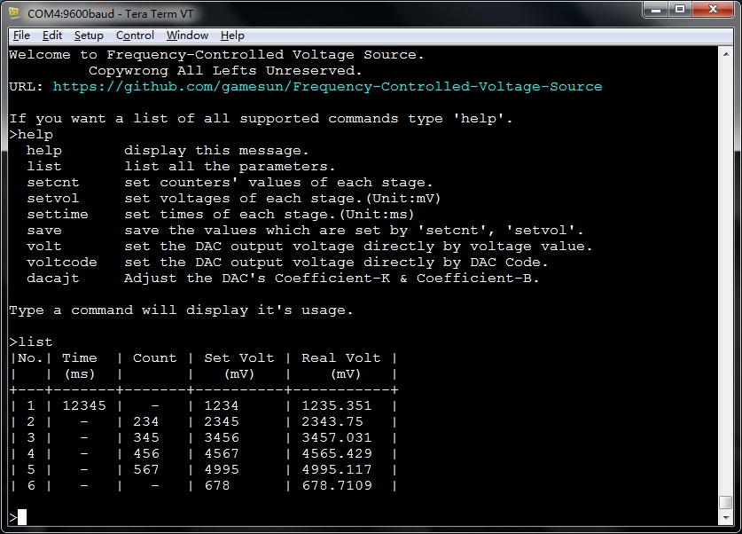
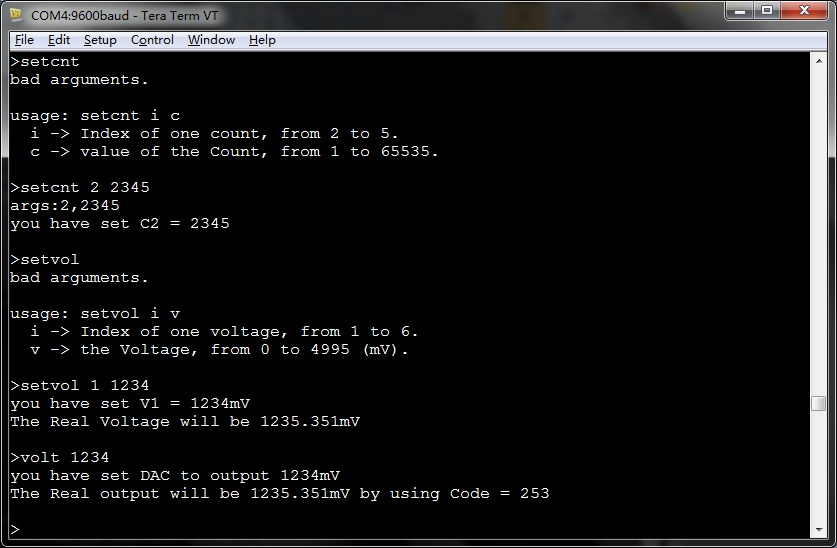
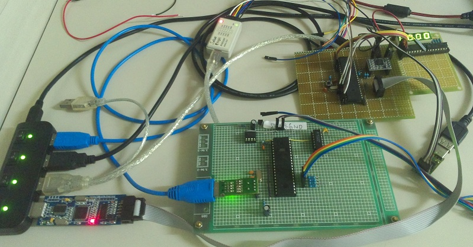

Frequency-Controlled-Voltage-Source
===================================

The firmware of a Frequency-Controlled Voltage Source by using ATmega16 and TLC5615.

It communicates with PC using the serial port.[9600,8,N,1]   
type "help" to list all supported commands.The picture below will show you how to use it.

